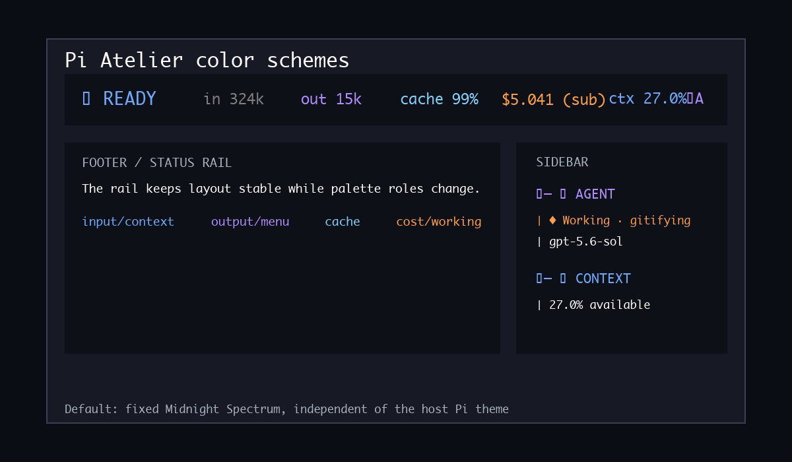

# Pi Atelier

A responsive status rail and live activity sidebar for [Pi](https://pi.dev).

This repository's `integration` branch is a permanent divergent line of Pi Atelier. It may include a mix of upstreamed, upstream-candidate, fork-only, and local-maintenance changes; see [Divergence policy](docs/divergence-policy.md) for branch stewardship rules.

Pi Atelier replaces Pi's default footer with a calm Status Rail and adds an optional docked sidebar for live agent, turn, tool, context, session, and project information.

Wide terminals use two stable zones: agent state and workspace identity stay left, while readable telemetry is right-aligned. By default the extension uses its fixed dark Midnight Spectrum—blue input/context, purple output/menu, cyan cache, amber cost/working, and red danger—while configuration can switch Atelier to Pi theme inheritance or custom role colors.

## Demo


Full-quality demo recordings can be attached to integration-line GitHub Releases without bloating Git clones or the npm package.

### Interface details

<table>
  <tr>
    <th width="72%">Status Rail and Atelier menu access</th>
    <th width="28%">Live Activity Sidebar</th>
  </tr>
  <tr>
    <td valign="top"></td>
    <td valign="top"></td>
  </tr>
</table>

### Color schemes

Pi Atelier defaults to its fixed dark Midnight Spectrum. Selecting a light, dark, or custom Pi theme does not change the Status Rail or sidebar colors unless `colorScheme` is configured. Set `colorScheme` to `"inherit"` to use Pi's active theme tokens, or provide a custom role map to override individual Atelier palette roles. With `NO_COLOR`, the Status Rail and sidebar emit no custom RGB and use theme-native neutral and semantic roles.



## Features

- Preserves cumulative input, output, cache-read, cache-write, cache-hit, cost, subscription, context, and compaction information
- Responsive one-line layout that never wraps
- Model and thinking-level controls
- Searchable tool controls
- Editorial, minimal, and classic display presets
- Session details, renaming, and safe compaction controls
- Default-on, session-scoped, non-capturing docked information rail with live run, turn, tool, response-performance, Workspace Pulse, and Todos activity
- Ordered, global-user Sidebar panel layout with draft editing, unavailable-panel retention, and a structured extension contribution contract
- Todo tracking for compatible `todo` results, including legacy details and the optional `@juicesharp/rpiv-todo` task format
- Completion notifications when a turn settles or Pi explicitly requests user input
- Fixed dark Midnight Spectrum by default, with Pi-theme inheritance, custom role colors, and a `NO_COLOR` fallback
- User and trusted-project configuration
- No telemetry or external network requests

## Requirements

- Pi 0.84.0 or newer
- Node.js 22.19.0 or newer
- Interactive TUI mode

## Install

```bash
pi install npm:@markfeinstein/pi-atelier
```

Try a checkout without installing it permanently:

```bash
pi -e ./pi-atelier
```

Pi packages execute with your full system permissions. Review third-party source before installation.

## Local development

```bash
git clone --branch integration https://github.com/markfeinstein/pi-atelier.git
cd pi-atelier
npm install
npm run check
npx --no-install pi -e .
```

## Contributing

See [CONTRIBUTING.md](CONTRIBUTING.md) for setup, validation, and pull request expectations for the divergent integration line.

## Footer anatomy

- `in` cumulative input tokens
- `out` cumulative output tokens
- `cache` latest cache-hit percentage in the editorial preset
- `read`, `write`, and `hit` detailed cache telemetry in the classic preset
- `$` cumulative estimated cost
- `(sub)` OAuth subscription-backed access
- `TTFT` opt-in time to first token for the latest response
- `TPS` opt-in generation throughput, prefixed with `~` while it is estimated
- `ctx` context utilization
- `(auto)` automatic context compaction
- `*` tracked working-tree changes

`READY` remains fixed when idle. During each work cycle, the working label is selected once and remains stable until the cycle ends. By default, Atelier uses a playful built-in phrase set—such as `KNEADING`, `MOONWALKING`, or `PONDERING`; set `workingLabels` to `false` for a static `WORKING` label, or to a list of your own phrases to replace the built-in set. When the full activity label fits, its ellipsis shrinks from `...` to `..` to `.` every 400 ms. The ellipsis reserves its maximum width so the model and following workspace text remain stationary. Narrower terminals use the compact, static `WORKING` label.

## Menu

Open Pi Atelier with:

```text
/atelier
```

The default shortcut is `alt+a`. Both entry points open the partitioned **Atelier Control Center**:

- **Settings** — the Display Settings Workspace, global Sidebar startup preference, completion notifications, and sidebar tool-list expansion
- **Controls** — session-scoped Sidebar visibility, model/thinking selection, and active tools
- **Actions** — session details, rename, and safe compaction

Open the Display Settings Workspace directly with:

```text
/atelier display
```

The workspace shows the real Status Rail renderer as a representative preview. Use Up/Down to select, Enter or Space to change a preset, density, or optional Segment, and Shift+Up/Shift+Down to reorder any Segment (including required `metrics` and `context`). `U` performs one-step Undo, `R` reverts Display Session overrides to the Effective lower-layer baseline, `S` saves the current Display as the User default, and Escape closes while retaining active Session overrides. Preset application is one atomic mutation, and Save keeps the workspace open so its result or any failure remains visible.

Additional commands:

```text
/atelier disable
/atelier enable
```

## Sidebar

The sidebar starts shown by default whenever the extension initializes and hides when the terminal is too narrow. Use **Settings → Sidebar on startup** to change this global user preference; it is saved immediately and applies from the next session or reload. An explicit `on` or `off` still applies only to the current runtime. Use these commands to control it explicitly:

```text
/atelier sidebar       # toggle between shown and hidden
/atelier sidebar on    # show it; safe to repeat
/atelier sidebar off   # hide it; safe to repeat
/atelier sidebar tools  # toggle active tool-name details
/atelier sidebar tools on|off
```

You can also press `alt+a` to access separate sidebar visibility and tool-detail controls from the menu. When enabled, the session-scoped rail attaches to the top-right, fills the terminal height, and stays visible without taking editor focus.

The Sidebar is an ordered, global-user surface separate from the footer `segmentLayout`. **Settings → Display** includes a Sidebar editor with a local draft, visibility toggles, Shift+Up/Shift+Down reordering, a Sidebar preview, one-step Undo, `D` product-default restore, explicit Save, and Escape-to-discard. Save rejects a draft with no visible panels. Built-in panel IDs are `agent`, `activity`, `subagents`, `alerts`, `todos`, `workspace`, `usage`, and `tools`.

Extensions may contribute structured panels through the public `pi.events` channel `pi-atelier:sidebar-panels` (or the exported `registerSidebarPanel` helper). A contribution uses a stable namespaced ID such as `my-extension:queue`, a title, text rows, and an optional semantic role. The event envelope is versioned and uses `type: "register"` (or `"unregister"`) with a contributor `source` and monotonic `revision`; Atelier emits `type: "discover"` during startup so contributors loaded first can replay their current panels. Atelier owns framing, palette, sanitization, truncation, responsive composition, and height omission; contributors cannot inject TUI components or ANSI. Registration, updates, discovery, and removal are lifecycle-safe, and discovery works regardless of extension load order. New contributed panels start hidden. A configured panel that is not currently registered remains in its saved position and appears as unavailable in Settings; it is not rendered until available again. If every configured-visible panel is unavailable, the sidebar says `No available panels` and points to Settings.

For compatibility, `showSidebarAgent` and `showSidebarTodos` are read when no user `sidebarPanelLayout` exists. A user `sidebarPanelLayout` takes precedence over those legacy fields and over trusted-project/session values. Sidebar layout is never read from project or session configuration, and saving it patches only the user file while preserving unrelated keys. The footer's ordered `segmentLayout` remains independent.

The scan-first hierarchy leads with agent state and model when enabled, followed by live Activity and Subagents panels, a Usage panel that combines the compact segmented context meter with cumulative token and cost usage, then a merged workspace summary. The Subagents panel listens to the optional `pi-subagents` lifecycle events when that package is loaded, restores current-session async runs from durable status artifacts after reload, and follows foreground progress plus background polling. It distinguishes queued, pending, running, stopping, detached, complete, failed, partial, paused, stopped, and rejected states; timeout, long-running, needs-attention, nested-child, external-job, and process-liveness details remain visible instead of collapsing to generic running or success. Terminal subagents remain in the recent list for 10 minutes. Workspace Pulse summarizes the entire Git worktree containing Pi's current directory: tracked changes, text additions and removals, and count-only untracked files. Binary files, changed submodules, and unresolved conflicts appear only when present; the first inspection, clean, unavailable, stale, and non-repository states remain explicit rather than being inferred from missing data. Pulse refreshes after tool activity, Turn boundaries, and branch changes without polling or watching external editor activity. It does not run tests, read untracked contents, change completion notifications, or add detail to the footer's existing dirty marker.

Below 40 sidebar columns, a unified compact mode stacks Agent metadata when enabled alongside Workspace metadata, uses inline Usage pairs, and collapses tool details so important values remain complete instead of truncating. At wider sizes, paired metrics and tool columns use intrinsic content measurements rather than stretching gaps across the available width. Usage always carries context availability; token and cost rows appear only when that data exists. Access type remains visible with the agent metadata. Active tool names are collapsed by default behind the tool count and can be expanded through the command or menu; that preference is saved to user configuration. Expanded names automatically collapse below 40 sidebar columns and reappear when widened. Routine healthy extension statuses stay hidden, while warnings and errors appear as explicit alerts.

## Completion notifications

Completion notifications are enabled by default and are event-driven rather than time-based. Atelier notifies when Pi reaches `agent_settled`, meaning no automatic retry, compaction retry, or queued continuation remains. When `@juicesharp/rpiv-ask-user-question` is installed, Atelier also listens to its stable blocked-state event and notifies only after its questionnaire is actually waiting for an answer. Notifications contain only project, session, and operational status; prompt and assistant-response content is never included.

macOS and Windows receive best-effort native system notifications through `osascript` or PowerShell. Other platforms do not receive completion notifications. Native notification processes are detached, time-bounded, and fail silently if unavailable; Atelier does not add a Terminal notification or fallback.

On macOS, `osascript` notifications are attributed to Script Editor. They respect the user's Script Editor notification settings and active Focus modes, so users may need to allow Script Editor notifications or add it to the active Focus mode's allowed apps.

Use `/atelier` or `alt+a` to disable or re-enable completion notifications. The preference is saved to user configuration.

The Activity panel always reserves fixed rows for the run summary and response performance. Before a value is available it displays `TTFT ~ · TPS ~`, so those metrics never shift position or disappear as requests start or terminal height changes. During an agent run, the sidebar also adds information the compact footer intentionally omits: current one-based turn, elapsed run time, active parallel tool calls, the three most recent tool results, per-tool durations, and total done/failed tool counts. TTFT runs from provider request dispatch to the first generated response content. During streaming, TPS updates from Pi's conservative output-token estimate and carries a `~` marker; after the response ends, final output usage replaces the estimate and removes the marker. The footer remains a stable one-line status rail; it shows response-performance metrics only when the opt-in `performance` segment is enabled and otherwise omits them.

The sidebar uses Pi's supported non-capturing overlay seam while reserving its columns in both Pi 0.84 renderer modes. Regular mode uses a bounded compatibility adapter that resolves the renderer implementation from the concrete `TuiMainScreen` prototype rather than capturing Pi's dynamic Proxy method. Fullscreen wraps Pi's existing layout root in an `HStack`, preserving the viewport on the left and reserving the Sidebar width on the right without replacing `render`. Unsupported renderers safely fall back to the overlay without modifying layout. The sidebar starts at 44 columns, can be resized between 28 and 72 columns, and auto-hides below 92 terminal columns.

Press `Ctrl+Shift+R` to enter temporary Sidebar interaction mode. Drag from the sidebar divider or either adjacent column and release to resize; click the Tools disclosure row to expand or collapse active tool names; click any panel crown to collapse or expand that widget body for the current session. Use Left/Right for one-column width adjustments, Shift+Left/Shift+Right for four-column adjustments, Enter to accept the current width, or Escape to restore the previous width. Mouse reporting is active only during this temporary interaction mode, so ordinary terminal text selection is unchanged at all other times.

Pi 0.84 cannot switch between regular and fullscreen renderers while any overlay is open. Hide the sidebar with `/atelier sidebar off`, switch TUI mode, then show it again with `/atelier sidebar on`. Atelier restores the non-overlapping split after the renderer switch. In fullscreen mode, Atelier prioritizes its temporary interaction listener ahead of Pi's transcript mouse-selection listener only while the mode is active, then removes it on exit.

In fullscreen mode, the split-layout sidebar remains a separate child so transcript selection and copy stay scoped to Pi output. The composer uses Atelier's rounded frame with inner padding where Pi exposes the editor customization seam; Pi supports one custom footer and one custom editor at a time, so extension load order determines which chrome is visible.

The Todos panel accepts both legacy Pi `todo` details (`todos` items with `done` booleans) and `@juicesharp/rpiv-todo` task details (`tasks` items with `pending`, `in_progress`, or `completed` states). The `@juicesharp/rpiv-todo` extension is optional and must be installed separately; Pi Atelier neither installs nor requires it. The panel shows `done/total` progress, status indicators (`✓` completed, `◐` in progress, `○` pending), and task IDs.

Todo state follows session-tree branch changes. Valid updates received while the sidebar is hidden remain current, valid empty lists clear the panel, and unknown task states are ignored rather than rendered as pending. With the sidebar visible and `showSidebarTodos` enabled, successful results containing at least one recognized task collapse in the workspace to a `done/total` summary; errors and malformed results remain fully visible.

## Configuration

User configuration:

```text
~/.pi/agent/pi-atelier.json
```

Trusted project configuration:

```text
<project>/.pi/pi-atelier.json
```

Project settings override user settings only after Pi trusts the project. Session-scoped JSON configuration can be supplied by appending the latest `pi-atelier:config` custom session entry, for example `pi.appendEntry("pi-atelier:config", { "colorScheme": "inherit" })` from an extension or SDK session setup. Most menu changes apply to the current session; **Save as user default** writes display configuration atomically. Sidebar startup visibility, Sidebar tool details, and completion notifications are saved immediately so those preferences survive future sessions. Sidebar startup visibility, Agent visibility, and completion notifications are global user preferences, so project and session configuration cannot override them. Pi Atelier never modifies project configuration from the menu.

Complete example:

```json
{
  "preset": "editorial",
  "shortcut": "alt+a",
  "density": "comfortable",
  "segmentLayout": [
    { "id": "brand", "visible": false },
    { "id": "activity", "visible": true },
    { "id": "metrics", "visible": true },
    { "id": "performance", "visible": false },
    { "id": "context", "visible": true },
    { "id": "model", "visible": true },
    { "id": "git", "visible": true },
    { "id": "statuses", "visible": true },
    { "id": "menu", "visible": true }
  ],
  "contextWarning": 70,
  "contextDanger": 90,
  "currencyDecimals": 3,
  "showSessionActions": true,
  "showSidebarToolNames": false,
  "showSidebarAgent": true,
  "showSidebarOnStartup": true,
  "sidebarPanelLayout": [
    { "id": "agent", "visible": true },
    { "id": "activity", "visible": true },
    { "id": "subagents", "visible": true },
    { "id": "alerts", "visible": true },
    { "id": "todos", "visible": true },
    { "id": "usage", "visible": true },
    { "id": "workspace", "visible": true },
    { "id": "tools", "visible": true }
  ],
  "showSidebarTodos": true,
  "completionNotifications": true,
  "colorScheme": "atelier"
}
```

`colorScheme` controls the footer and sidebar palette:

- `"atelier"` keeps the default fixed Midnight Spectrum.
- `"inherit"` maps Atelier roles to Pi's active theme tokens.
- A custom object may include `base: "atelier"` or `base: "inherit"` plus any Atelier role names: `accent`, `primary`, `muted`, `dim`, `ready`, `working`, `input`, `output`, `cache`, `cost`, `context`, `menu`, `warning`, and `error`.

Custom role values accept documented Pi theme tokens such as `"accent"`, `"warning"`, or `"thinkingHigh"`, 6-digit hex RGB colors such as `"#cba6f7"`, xterm 0-255 color indices, or `""` for the terminal default foreground. In inherited mode, neutral text uses `text`/`muted`/`dim`, and Atelier keeps its highlight families while sourcing them from Pi: ready/input/context use a calm thinking color, output uses Pi's high-emphasis thinking color, cache uses a type/syntax color, cost uses heading emphasis, working/warning use Pi warning, and workspace/Todos/menu use accent.

`colorScheme` layers like the display settings above. A custom object merges role by role over the layer below it and keeps that layer's base unless it names its own, so a project that sets `{ "output": "#ff00ff" }` over a user `"inherit"` keeps inheriting every other role. Setting `"atelier"` or `"inherit"` replaces the scheme outright, which is the way to discard role overrides from a lower layer.

Color scheme examples:

```json
{
  "colorScheme": "atelier"
}
```

```json
{
  "colorScheme": "inherit"
}
```

```json
{
  "colorScheme": {
    "base": "inherit",
    "output": "#cba6f7",
    "cache": 45,
    "working": "warning"
  }
}
```

`segmentLayout` is ordered and every entry has explicit visibility. Pi Atelier preserves the first valid occurrence of each known ID, appends omitted IDs in Product order, and repairs `metrics` and `context` to visible without moving them. Unknown, duplicate, or malformed values produce one de-duplicated warning. Brand and extension Statuses rendering is controlled only by this normalized layout. Performance remains available for TTFT/TPS telemetry but is hidden in all three compatibility templates.

Product defaults are layered with **User default**, trusted **Project override**, then **Session overrides**. The resulting value is the **Effective baseline** shown by the workspace. Pi Atelier tracks the source of density, preset identity, layout order, and each visibility value; untrusted project configuration is not read. Workspace changes are Session-scoped and immediately update the live rail. **Save** atomically patches `preset`, `density`, and a cloned `segmentLayout` into User configuration and, when the Sidebar draft is dirty, also patches `sidebarPanelLayout`; unrelated and unknown keys are preserved, and it never writes Project configuration. **Revert** clears only Display Session fields, and one-step **Undo** restores the raw Session snapshot, including after Revert. Any density, order, or visibility combination that does not exactly match a complete template has the `custom` preset identity; restoring an exact template restores its named identity.

Legacy `segments`, `ornament`, and `showExtensionStatuses` keys remain load-compatible and are translated into a complete normalized layout. A usable `segmentLayout` is authoritative over those keys in the same layer. Legacy omitted segments remain present but hidden; legacy Brand and Statuses combinations retain their prior visible result. Brand and Statuses have no overlapping runtime gates: normalized `segmentLayout` is the sole visibility source. New configuration should use `segmentLayout`.

During streaming, TPS is prefixed with `~` while it is estimated, then replaced with final throughput when the response ends. Each value is dimmed to `~` until it is measured. Visibility toggles retain an entry's position, and reordering includes hidden entries.

`workingLabels` controls the working-state label. Omit it to keep Atelier's built-in playful phrases, set it to `false` for a static `WORKING` in the footer and `Working` in the sidebar with no ellipsis animation, or set it to a non-empty array to select randomly from your own phrases:

```json
{ "workingLabels": false }
```

```json
{ "workingLabels": ["THINKING", "WORKING", "PROCESSING"] }
```

Entries are trimmed, and blank or non-string entries are dropped with a warning. A list that leaves no usable entry warns and falls back to the built-in phrases. Like other layered keys, a trusted project or session value replaces the user value rather than merging with it.

`showSidebarOnStartup` (default `true`) controls whether a new session opens the Sidebar automatically. It is a global user-only preference; trusted project and session values are ignored. Change it from **Settings → Sidebar on startup**. The `/atelier sidebar on|off` commands remain available for the current runtime regardless of this preference.

`showSidebarAgent` controls whether the Agent panel renders inside the sidebar. It is a global user-only compatibility input; trusted project and session values are ignored. When set to `false`, the sidebar still shows but omits the agent state and model metadata section while leaving Activity, Todos, Workspace, Usage, and Tools unaffected. Use **Settings → Display** to edit the ordered Sidebar layout.

`showSidebarTodos` (default `true`) is the corresponding global user-only compatibility input for the Todos panel. Trusted project and session values are ignored. Set it to `false` to disable the panel and show complete todo output in the workspace. See [Sidebar](#sidebar) for supported result formats and Todo output behavior.

## Presets

- **editorial** — default Status Rail with activity, workspace identity, cache-hit summary, and telemetry
- **minimal** — compact activity, metrics, context, model, and menu
- **classic** — detailed cache telemetry, context, model, Git, and extension statuses

## Responsive behavior

The Status Rail removes optional information by priority as the terminal narrows instead of switching to fixed layouts. Brand and extension statuses are removed first, followed by Git and thinking level, cost, model, input and output totals, response performance, cache, and finally the menu shortcut. Activity and context are retained longest, and the result is truncated safely rather than wrapping when space is exceptionally tight.

## Privacy and security

Pi Atelier:

- Performs no telemetry, analytics, or external network calls
- Does not store prompts, responses, credentials, or session content
- Never includes prompt or assistant-response content in completion notifications
- Reads structured usage metadata already available inside Pi
- Executes read-only local Git worktree inspection after relevant Pi events to show branch and Workspace Pulse counts; untracked file contents are never read
- Invokes `osascript` on macOS or PowerShell on Windows for enabled best-effort system notifications
- Reads project configuration only when Pi reports the project as trusted

## Footer conflicts

Pi supports one custom footer at a time. If multiple extensions call `setFooter`, extension load order determines which footer is visible. Pi Atelier does not wrap undocumented footer internals. Disable it with `/atelier disable` to restore Pi's built-in footer.

## Troubleshooting

### The menu shortcut does not open

Some terminals or personal keymaps intercept `alt+a`. Use `/atelier`, then choose another shortcut in `pi-atelier.json` and run `/reload`.

### Metrics differ from the current context percentage

Token and cost metrics are cumulative across the entire session. Context percentage describes only the current model context after compaction.

### The footer is missing

Pi Atelier intentionally does not install terminal UI in print, JSON, or RPC modes. In TUI mode, check whether another extension replaced the footer later in load order.

## Maintainer-only publishing

Contributors must not publish packages, change release versions, create tags or releases, change npm dist-tags, or edit npm publishing credentials. Maintainers own release verification, merging, releases, and publishing for `@markfeinstein/pi-atelier`.

See [Release checklist](docs/release.md) for the publishing flow. Routine releases publish the scoped package as the default npm line.

## License

MIT
